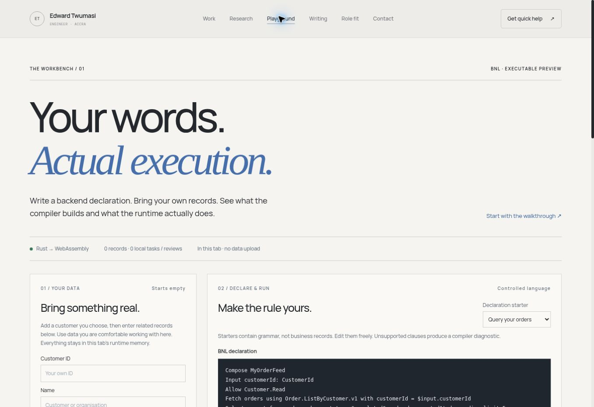
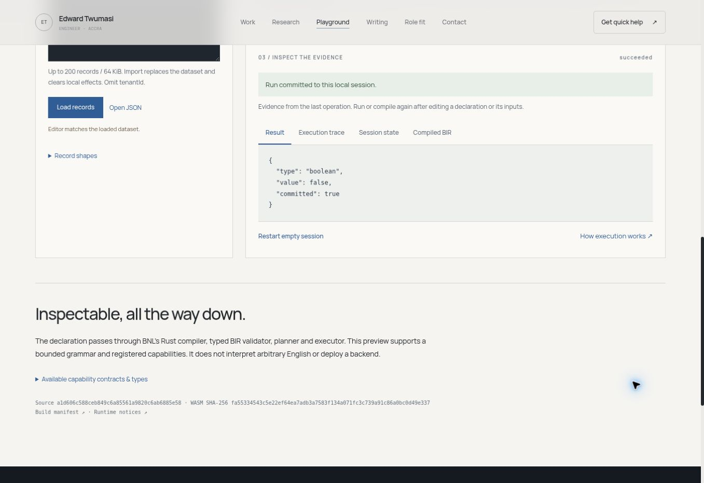

# Captioned production evidence — 28 September 2026

Verified public release: cb61c49e5fe133ee465d13f4e965af4511443721 (portfolio PR64). Vercel reported deployment success and the public browser loaded the expected Rust/WASM artifact. Capture timezone: Africa/Accra, UTC.

## Empty public workspace

The runtime loaded successfully with zero business records. Source a1d606c588ceb849c6a85561a9820c6ab6885e58 and WASM fa55334543c5e22ef64ea7adb3a7583f134a071fc3c739a91c86a0bc0d49e337 matched the verified artifact. No fake customers, orders, payments or messages were supplied by the product.

## A real public execution

The public compiler executed Compose LiveRuleCheck, with Input days: integer, Check eligible when $input.days > 30, and Return eligible. Supplying 31 returned true; changing it to 12 returned false. The image records the second execution. These are deliberately supplied verification inputs, not preloaded business records. Data remained in the browser session.

## GroundControl verification evidence

A read-only script loaded existing scorecards and printed the observed results in GC's live terminal: 37/37 shipping HTTP, 33/33 delivery/migration, 31/31 actual-WASM browser acceptance, and successful process exit codes. It is not a native GC metrics panel or an autonomous Loop run. The screenshot is cropped to exclude infrastructure identifiers and the shell prompt; result pixels are unchanged.

## Original acceptance captures

| Capture | Evidence scope |
|---|---|
| [Empty desktop](01-empty-desktop.png) | Actual production bundle in isolated GC Chromium; no initial records. |
| [Executed result](02-real-result-desktop.png) | Actual WASM using synthetic records explicitly supplied by the test harness. They are not product defaults. |
| [390px mobile](03-mobile-empty.png) | Responsive full-page capture; mobile overflow and keyboard navigation checked in the scorecard. |

[Screenshot manifest](../../../public/images/bnl/manifest.json) records file hashes, dimensions, captions, source and artifact identity. [Final browser scorecard](browser-scorecard.json) documents the 31 assertions; screenshots alone do not prove every assertion. Failed attempts and build logs remain in this directory.

Images are embedded in the public getting-started article, GroundControl delivery case study and revised terminal article. Parallel context is preserved in GroundControl docs/articles/bnl-playground-from-the-browser.md and the private BNL production evidence directory. Native-provider acceptance, independent review/research and Mac acceptance remain separate.
